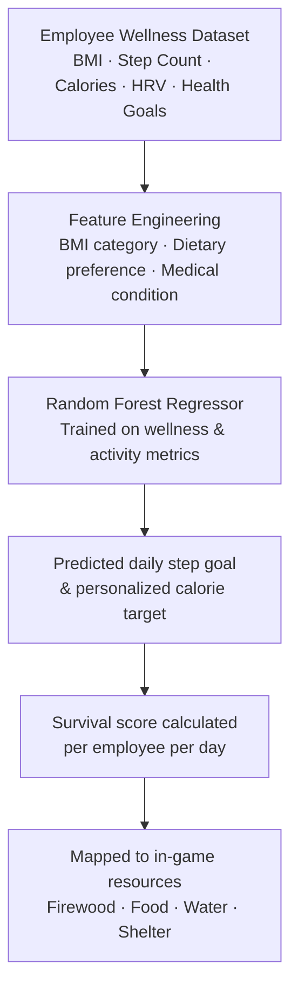
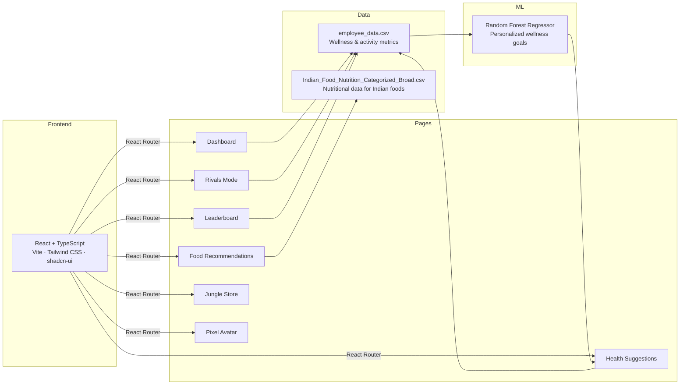

# 🏝️ Corporate Wellness

<!-- BADGES ROW 1 — Tech -->


> **Built for corporate teams** · Gamified survival adventure · AI-powered wellness goals · Indian food nutrition engine · Rivals & leaderboards

---

## What is Corporate Wellness?

Corporate Wellness is a **gamified employee health platform** that turns real-world wellness into a survival adventure. Instead of boring dashboards, employees collect in-game survival resources — firewood, food, water, shelter — by hitting real health goals like step counts, sleep quality, and smart food choices. Fall behind on your wellness and your island suffers in-game disasters.

The core intelligence is a **Random Forest Regressor trained on employee wellness data** that predicts personalized daily step goals and calorie needs based on each employee's BMI, age, and health objectives. Layered on top are an Indian food nutrition recommender, a team Rivals Mode, a pixel avatar creator, a Jungle Store rewards system, and a full leaderboard — all in a React + Vite + TypeScript app styled with Tailwind CSS and shadcn/ui.

---

## Features

| Feature | What it does |
|---|---|
| 🗺️ **Dashboard** | Personal wellness stats, team scores, today's points, and top players at a glance |
| 🥗 **Food Recommendations** | Browse Indian food nutrition data, build a meal cart, and track calorie intake vs. your daily goal |
| 💪 **Health Suggestions** | AI-driven personalized step targets and calorie goals based on BMI and health objectives |
| ⚔️ **Rivals Mode** | Create team-vs-team or player-vs-player wellness challenges with wagered points and a countdown timer |
| 🏆 **Leaderboard** | Live rankings by wellness score across all employees with pixel avatar display |
| 👥 **Players** | Browse all employees, view profiles, and assign wellness points |
| 🎮 **Pixel Avatar Creator** | Build a custom pixel-art avatar from body, hair, outfit, and accessory options |
| 🛒 **Jungle Store** | Spend earned wellness points on in-game survival items and perks |
| 🔐 **Auth** | Sign-in and sign-up flows with protected game layout routing |

---

## How the ML model works



The model (`Team_SJRK_MLCODE.py`) is trained on `employee_data.csv` and integrates with `Indian_Food_Nutrition_Categorized_Broad.csv` to calculate energy buffs, macro breakdowns, and survival bonuses from meal choices.

---

## Architecture



---

## Project Structure

```
corporate-wellness/
├── src/
│   ├── App.tsx                     # Route definitions + game layout wrapper
│   ├── pages/
│   │   ├── Dashboard.tsx           # Wellness stats, top players, recent activity
│   │   ├── FoodRecommendations.tsx # Indian food nutrition browser + meal cart
│   │   ├── HealthSuggestions.tsx   # AI-driven personalized wellness goals
│   │   ├── RivalsMode.tsx          # Team & player challenge creation
│   │   ├── Leaderboard.tsx         # Live employee rankings by wellness score
│   │   ├── Players.tsx             # Employee directory + point assignment
│   │   ├── Profile.tsx             # Individual employee profile view
│   │   ├── JungleStore.tsx         # Points-based reward store
│   │   ├── AvatarCreation.tsx      # Pixel avatar builder
│   │   ├── SignIn.tsx              # Authentication
│   │   └── SignUp.tsx
│   ├── components/
│   │   ├── GameSidebar.tsx         # Navigation sidebar with game branding
│   │   ├── PixelAvatar.tsx         # Pixel art avatar renderer
│   │   ├── StatCard.tsx            # Reusable metric card component
│   │   └── ui/                     # shadcn-ui component library
│   ├── hooks/
│   │   └── use-toast.ts
│   └── lib/utils.ts
├── employee_data.csv               # Employee wellness & activity dataset
├── Indian_Food_Nutrition_Categorized_Broad.csv  # Indian food nutrition data
├── avatar.js                       # Avatar generation logic
├── Team_SJRK_MLCODE.py             # Random Forest ML model (wellness predictions)
├── index.html
├── package.json
├── tailwind.config.ts
└── vite.config.ts
```

---

## Getting Started

### Prerequisites
- Node.js 18+ and npm
- (Optional) Python 3.9+ to run the ML model locally

### Run locally

```bash
# Clone the repo
git clone https://github.com/yourusername/corporate-wellness.git
cd corporate-wellness

# Install dependencies
npm install

# Start the development server
npm run dev
```

App runs at `http://localhost:8080`

### Build for production

```bash
npm run build
npm run preview
```

---

## Datasets

| Dataset | Description |
|---|---|
| `employee_data.csv` | Employee wellness and activity metrics used to map real-world behavior to survival game resources |
| `Indian_Food_Nutrition_Categorized_Broad.csv` | Nutritional data for Indian foods used to calculate energy, macros, and survival buffs/penalties |

### employee_data.csv columns

| Column | Description |
|---|---|
| `Employee_ID` | Unique employee identifier |
| `Name` | Employee name |
| `Age` | Age in years |
| `Gender` | Gender |
| `Height_cm` / `Weight_kg` | Physical measurements |
| `BMI` | Body Mass Index |
| `Dietary_Preference` | Veg / Non-veg / Vegan |
| `Allergies` | Declared food allergies |
| `Health_Goals` | Weight loss / Maintenance / Gain |
| `Medical_Condition` | Reported conditions |
| `Daily_Calories_Required` | Calculated daily caloric need |
| `Heart_Rate_bpm` | Resting heart rate |
| `Step_Count` | Daily steps |
| `Calories_Burned` | Daily calories burned |
| `SpO2` | Blood oxygen saturation |
| `HRV` | Heart rate variability |
| `Team_Name` | Employee's team |
| `Role` | Job role |
| `Wellness_Score` | Composite wellness score (used for leaderboard & survival resources) |

---

## Pages & Routes

| Route | Page | Description |
|---|---|---|
| `/` | Sign In | Entry point — authentication |
| `/signup` | Sign Up | New user registration |
| `/avatar-creation` | Avatar Creation | Pixel avatar builder post sign-up |
| `/dashboard` | Dashboard | Overview of wellness stats, team scores, top players |
| `/food` | Food Recommendations | Indian food nutrition browser + meal cart |
| `/health` | Health Suggestions | AI-personalized step goals and calorie targets |
| `/rivals` | Rivals Mode | Create team or player wellness challenges |
| `/leaderboard` | Leaderboard | Employee rankings by wellness score |
| `/players` | Players | Browse employees and assign points |
| `/profile/:id` | Profile | Individual employee profile |
| `/jungle-store` | Jungle Store | Spend wellness points on in-game perks |

---

## Built by

**Kumaraswamy G** 

[](https://linkedin.com/in/kumaraswamy-g-872b81277/)
[](mailto:kumaraswamyg2004@gmail.com)

---
